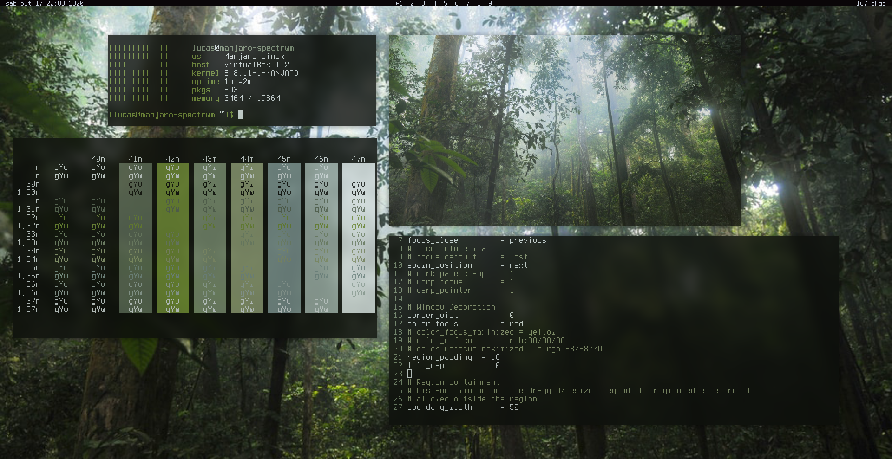
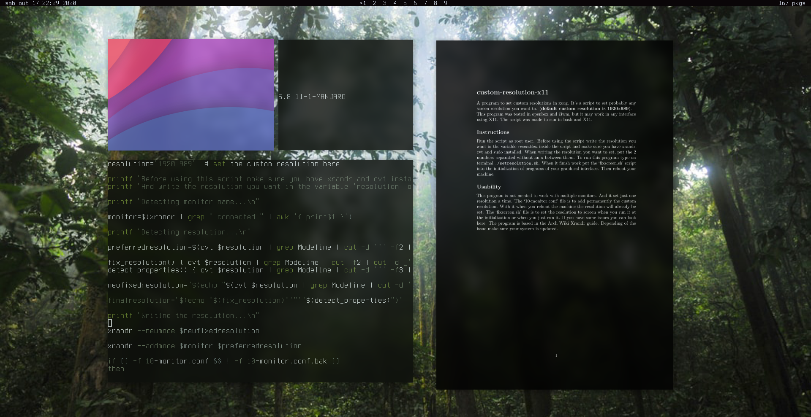

# Spectrwm-configs

This would be my environment if I didn't like desktops.

It is a simple keyboard/terminal-driven environment with *spectrwm*. This would be my main environment if I didn't like to have a full desktop. It can be well integrated with other components, like the fullscreen app launcher, from my real main environment at [dotfiles](https://github.com/Firespindash/dotfiles). \
To install use the *install.sh* script. Make sure you have a backup of your previous spectrwm, polybar, and compton configs before using the script. \
My version of an screenshot from [u/Harjuu](https://www.reddit.com/r/unixporn/comments/gcg0hh/spectrwm_first_post/) in *Manjaro*.

Screenshot of the main environment with *Zathura*. 

## Programs
The table with the main programs in it:
|                Type               |     Name    |
|-----------------------------|:--------------:|
|            Terminal            | *Alacritty* |
|             Browser            |   *Falkon*  |
|         Video Player        |     *mpv*    |
|        File Manager        |  *thunar*  |
| Graphical Text Editor |    *gedit*   |
|        Image Viewer        |   *qview*   |
|       Screen Locker       |    *xlock*   |

These are the same programs that I use in my real environment, except *xlock*. And all these, and others, are necessary for it to work properly.
## Shortcuts
Main shortcuts:
|                                Function                              |         Keybind         |
|----------------------------------------------------------|:-----------------------:|
|                            Opens Menu                           |        Super+p         |
|                           Moves Window                         | Super+Control+z |
|                          Resizes Window                        | Super+Control+x  |
|                             Kills Window                           |          Super+x        |
|                      Toggles Float State                      |          Super+t        |
|                       Toggles Fullscreen                      |          Super+e        |
|                Changes Workspace (1-4)                  |       Super+1...4       |
|                                 Restart                                |          Super+q       |
|                                 Logout                                |    Super+Shift+q   |
| Switchs between *spectrbar* and *polybar* |    Super+Shift+b   |

Most of the other keybinds are vim-like, common in other WMs. I just can't get easily used to them.
## Details
The wallpaper was an inspiration from [u/jalapon](https://www.reddit.com/r/unixporn/comments/g549vq/bspwm_studying_birds_migration_is_easier_with_a/). It also contains an useful *polybar* theme, that I used in the past and wanted to save somehow, press `Super+Shift+b` ;). If you want to go a bit more graphical, using the *polybar* theme is nice. \
It comes with some scripts I found useful which are stored in `~/bin`. The *polkit.sh* script is for starting a polkit agent in a minimum environment. The location of the polkit agent to start changes for different agents, and you have to change it on the script if you want to use other polkit agent. The agent that is started on the script is the *polkit-qt5*.  The *update-notif.sh* script is for checking if there's any system updates when the environment is started. \
The *webdevLayout.sh* script automatically sets a terminal window in a configuration (size and place) I used to set to do web development. And the *shutdown.sh* is a script that opens a shutdown menu in dmenu, good for going a bit more graphical too. It can also be accessed by right-clicking the power button in the *polybar* theme. \
Also the *alttab* program is started in the *.bashrc* file, because of a bug that happened when I tried to start it in the *autostart* script or *.xprofile* file, it showed ghost windows, like the *compton* compositor, for instance. And the *.profile* just sources the `$PATH` again to include the `~/bin` folder.
## Extras
It also comes with an uninstall script, because why not? [mint-i3wm/#1](https://github.com/Firespindash/mint-i3wm/issues/1#issue-626789180)